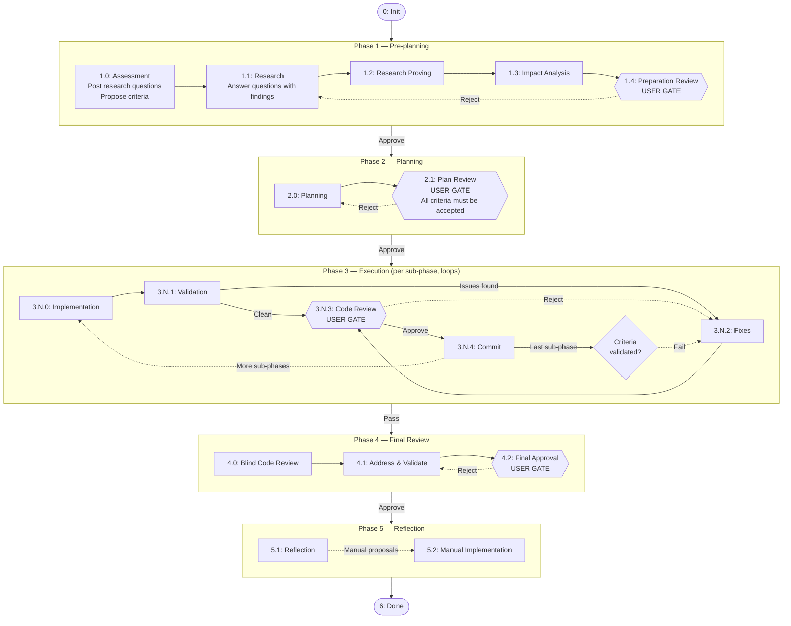

# Claude Governed Workflow

A zero-trust orchestration layer for Claude Code that enforces phase progression, scope constraints, and human approval gates on agentic coding sessions. Instead of letting the agent self-certify its work, every phase transition is validated server-side — research must be proven, file edits are scope-locked, and critical checkpoints require explicit human approval through the admin panel.

The system ships as a set of Claude Code extensions: agent definitions, hook scripts, skills, and a Flask-based admin panel with an MCP server.

## How It Works

The workflow moves through assessment, research, planning, execution, review, reflection, and delivery. Four transitions are **user gates** that halt progress until a human approves or rejects via the admin panel.

Hexagonal nodes are **user gates** — the workflow pauses until a human approves or rejects. Diamond nodes are validation checkpoints. Rectangular nodes advance automatically when their criteria are met.

## Key Concepts

**Phase advancement.** The agent calls `workspace_advance` — the backend decides the next phase. Each phase has an advancer that validates prerequisites (progress documented, research proven, scope changes present, commit hash valid). Failures return specific errors explaining what's missing.

**User gates.** Preparation Review (1.4), Plan Review (2.1), Code Review (3.N.3), and Final Approval (4.2) generate cryptographic nonces. Only the admin panel UI can present them, ensuring the agent cannot self-approve. Phases 5.1 and 5.2 advance automatically — no user gate.

**Scope locking.** Each execution sub-phase defines `must` (required changes) and `may` (permitted boundary) file patterns. Pre-tool hooks enforce these at edit time — the agent physically cannot write outside its scope. Scope and plan carry separate approval statuses. Updating either one auto-revokes its approval, requiring the user to re-approve before execution can continue.

**Research proving.** Researchers save findings with typed proofs (code:file:line, web:url, diff:commit). A separate prover agent verifies every proof before the workflow continues. No unproven claims pass. Rejected entries must be re-researched and re-proven before the workflow is allowed to advance past the research proving phase.

**Research discussions.** The agent posts research questions during assessment. Each question must be linked to at least one research entry before the workflow can advance past the research phase. Users can review questions, add their own, and reply in threaded discussions.

**Acceptance criteria.** During assessment and planning, the agent proposes acceptance criteria (unit tests, integration tests, BDD scenarios, custom checks) via MCP. Users accept or reject them in the admin panel. On the last execution commit, the server programmatically validates test-type criteria — it checks that named test methods actually exist in the specified test files. Plan approval is blocked if any criteria remain unresolved.

**Verification profiles.** Automated code quality checks that run at phase validation (3.N.1). Each profile targets a language or toolchain (Java Gradle, Python, TypeScript, etc.) and contains ordered steps: compilation, formatting, linting, static analysis. Each step has an install check command, an auto-install command, and a fail severity (blocking or warning). Profiles are global — not workspace-specific — but assigned per-workspace. The system ships with 4 preset profiles; users can create custom ones via the admin panel or setup wizard.

**Plan structure.** The execution plan includes system diagrams (class diagram and sequence diagrams in Mermaid) and tasks organized into sub-phases. Tasks can declare parallel groups for fork/join execution. Each sub-phase has its own scope (must/may file patterns), so different sub-phases can touch completely different parts of the codebase.

**Execution sub-phases.** The plan defines N sub-phases (3.1, 3.2, ...), each cycling through Implementation, Validation, Fixes, Code Review, and Commit. Production code and tests are always written by separate agents to maintain objectivity.

**Agent roles.** The orchestrator coordinates 16 specialized agent roles. A plan-advisor runs as a persistent teammate across the entire session. Production code and tests are always written by separate agents — engineers never write tests, test engineers never write production code. Phase 4.0 reviewers work blind with zero implementation context.

**Reflection.** After Final Approval the workflow enters phase 5.1 (Reflection) in a fresh session. The orchestrator calls `workspace_get_reflection_context` — which packages scope, branch diff, open review findings, and the session transcript with sub-agent transcripts inlined and `tool_use` noise stripped — then spawns the `reflector` agent. The reflector submits proposals (nine types: memory writes/deletes, rule creates/updates, agent creates/updates, skill creates/updates, workflow improvements) each marked `auto` or `manual`. Auto proposals are applied immediately by the orchestrator; manual ones route to phase 5.2, where per-type sub-agents implement them. Done is phase 6.

**Review system.** All review feedback — user comments, agent findings, and blind reviewer issues — lives in a single `discussions` table with `scope='review'`. Each review item carries a `resolution` status (`open`, `fixed`, `false_positive`, `out_of_scope`). Agents set the resolution after addressing feedback; users resolve items in the admin panel. A cross-cutting `ReviewGuard` blocks phase advancement until all review items are user-resolved. This applies to execution phases (3.N.K), address & fix (4.1), and final approval (4.2).

**Session recovery.** When a session ends (context compaction or restart), all teammates are lost. The orchestrator re-spawns them using progress entries that document what happened at each phase — actions taken, obstacles hit, decisions made, files changed.

**Telegram integration.** Sessions can be controlled remotely via a Telegram bot. The Telegram module replaces the default plugin with a custom multi-session server, allowing multiple Claude Code sessions to share one bot — each session prefixes replies with its workspace name (e.g., `[mp-72]`). Telegram users can list active sessions with `/sessions` and switch between them with `/switch <name>`. Orphan detection ensures that if the polling session dies, another session auto-recovers within seconds. Setup: `/telegram-multi-session install`.

**Modules.** Self-contained feature packages that live at `<repo>/claude/modules/`. Each module is a directory containing a `SKILL.md` and any supporting files the module needs. Modules are discoverable — the admin panel scans the directory for available modules. Users enable or disable modules via the Setup page or the Modules card on the dashboard. The system currently ships with the Telegram module for remote session control.

**Setup wizard.** Accessible from the project selector page in the admin panel. Configures modules and verification profiles in one go. Launches Claude Code in an embedded terminal and follows the setup skill to install selected modules, verify required tools, and create or assign verification profiles.

## Security Model

Governed Workflow is a workflow-governance layer for Claude Code. It is designed to prevent accidental or overconfident agent bypasses, not to defend against a malicious local user, a compromised machine, or a hostile network.

### What is protected

- **Admin authentication.** Every HTTP and WebSocket route (except the login-screen helpers and the local hook endpoints) requires an admin bearer token. The token is generated only via the CLI (`python3 admin-panel/backend/app.py auth-token`) — there is no web-facing endpoint that can mint one. The plaintext is never persisted; only its SHA-256 hash lives in the SQLite `device_settings` table. There is no environment variable or runtime flag that disables the middleware.
- **Governed-workflow tree block.** A workspace-agnostic check runs in the hook API before workspace resolution and before the yolo bypass. Any `Edit`/`Write`/`Bash` that targets a path inside the governed-workflow install (admin panel source, SQLite DB, hooks, shipped rules) is denied. The single exemption is the self-edit context: cwd already inside the install tree, used by maintainers developing the admin panel itself.
- **cwd-escape.** Because the block above runs before workspace lookup, an agent that does `cd /tmp` to land outside any registered workspace cannot reach governed-workflow files either.
- **Direct admin-API access.** Bash commands containing `curl/wget/python/ruby/node/fetch` to `localhost:5111` are denied — agents must use MCP workspace tools.
- **Per-workspace scope.** During execution sub-phases, edits are restricted to the `must`/`may` patterns of the current sub-phase scope. Plan and scope each carry an approval status; updating either revokes its approval.
- **User gates.** Phases 1.4, 2.1, 3.N.3, and 4.2 halt until the user clicks Approve in the admin panel. The agent has no way to self-approve. Phases 5.1, 5.2, and 6 advance automatically.
- **DB file permissions.** The SQLite database and its WAL/SHM sidecars are `chmod 0600` on `init_db()` so other local users on the machine cannot read them.
- **Fail-closed hook.** When the admin API is unreachable, the pre-tool hook denies every tool — no local guesses about which tools are safe.

### What is NOT protected

- **Read access by other code running as your user.** Any process you launch can still read the SQLite DB and the admin panel source. The 0600 permissions only block *other* local users.
- **A compromised user account.** If someone has shell access as your user, they can read the admin token from your browser's localStorage or sniff it from local network traffic (the panel speaks plain HTTP).
- **Network exposure.** Network mode binds to `0.0.0.0:5111` for LAN access. The admin token is the only barrier — do not enable network mode on untrusted networks, and do not expose port 5111 to the public internet.
- **Read of governed-workflow source.** The path block covers `Edit`/`Write` and Bash commands. It does not currently block `Read`/`Glob`/`Grep`/`LS` of those paths. The token hash itself reveals nothing useful, but any agent can still read source code from the install tree.

### YOLO mode is not a security feature

`yolo_mode` is a per-workspace toggle that bypasses scope and plan-approval checks for fast experimentation:

- An agent in yolo can write to any file inside its workspace working directory, regardless of scope or approval status.
- The governed-workflow path block still applies — yolo cannot reach the admin panel, DB, hooks, or shipped rules.
- User gates still halt the workflow — yolo only relaxes file-write checks.
- Use it only for throwaway workspaces or trusted sandboxes. Never enable it against production code.

### Trust assumptions

- The local machine is trusted; no other malicious user with shell access.
- The user controls the running admin panel.
- Network mode is used only on trusted LANs or behind a secure tunnel.
- Port 5111 is never exposed directly to the public internet.
- The admin token grants full control over the workflow.
- Browser-stored credentials may be accessible to sufficiently privileged local tools.

## Getting Started

Clone the repo, then see [admin-panel/README.md](admin-panel/README.md) for installation and full API/MCP tool reference. For a step-by-step install including Windows/WSL, use the `/workflow-migration` skill.

